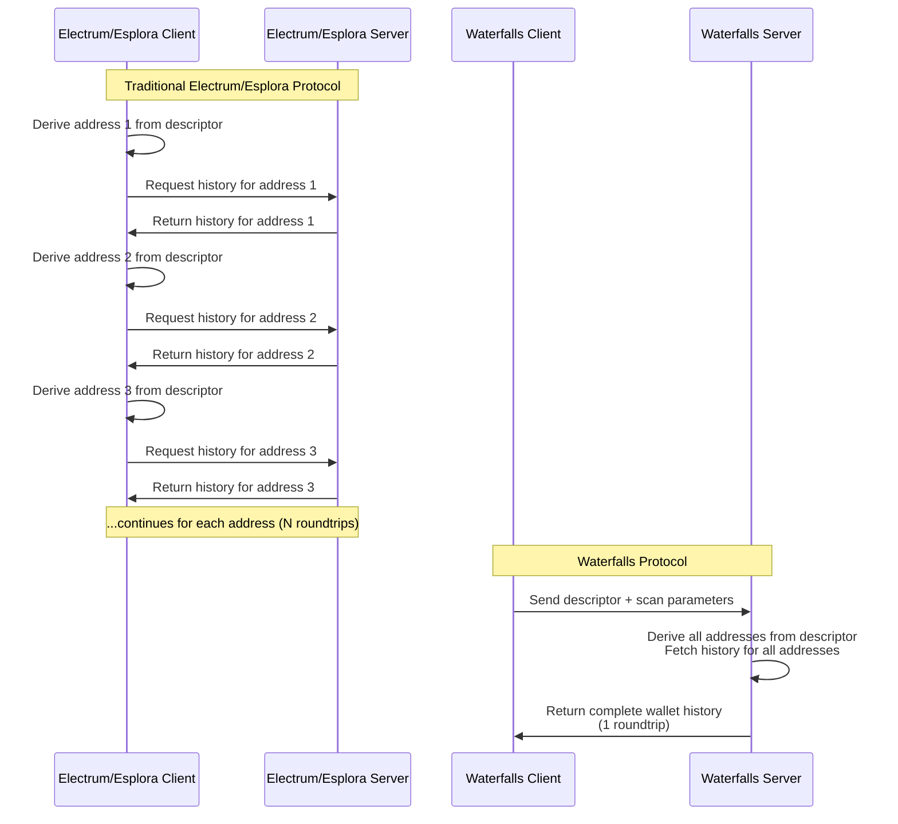

# Waterfalls

Waterfalls is a new scanning mechanism for web light-clients wallets that leverages a new server endpoint. It works for bitcoin and liquid. See [API.md](API.md) for complete API documentation.

It also has an UTXO-only mode to allow wallets to know their balance and being able to construct transaction in a faster way, at the expense of not knowing entire transaction history.

## Comparison

### Protocol Architecture Difference

The fundamental difference between Waterfalls and traditional electrum  or esplora protocol based projects lies in how they handle address derivation and data fetching:



**Electrum Protocol**: Client calculates addresses locally and makes individual requests for each address, resulting in many network roundtrips.

**Waterfalls Protocol**: Client sends the descriptor to the server, which derives all needed addresses server-side and returns the complete wallet history in a single response.

Note: in both cases wallet history refer to txids in both cases the client must ask for transactions if they aren't already cached.

### Performance Comparison

We are going to compare the waterfalls scan against the traditional scan using the Esplora API using LWK full_scan.
The measures are calculated using a test in this repository:

```
cargo test --release test_waterfalls_vs_esplora_performance -- --ignored --nocapture
```

### Esplora

Due to browser limitations the web wallet must use HTTP esplora API. 

With this API we cannot batch requests like it's done in the electrum client, and we cannot make requests concurrently because rate limitation is enforced in the server, this result in very poor scan performance.

Since we are persisting wallet data in the browser (encrypted), the scan following the first are faster.

### Waterfalls

Currently used at https://liquidwebwallet.org

The new waterfalls client avoids multiple requests by sending the bitcoin descriptor to the server.
This has privacy implications, but we argue it's not that different than sending all of our addresses separately to the server. Specifically in the latter case we are not sending the knowledge of future addresses that are derivable from the descriptor in the former case. The real privacy gain is moving to a self-hosted server or to a personal node.
Moreover, liquid specifically has the advantage of having confidential transactions and the blinding key is not sent to the server, thus a malicious server would know about the transactions of the wallet, but nothing about the assets exchanged and the value transacted.


### Results

| txs  | water | first     | second    | req #1 | req #2 |
|-----:|-------|----------:|----------:|-------:|-------:|
| 2    | false | 3.218s    | 2.124s    | 68     | 62     |
| 65   | false | 13.087s   | 7.138s    | 294    | 164    |
| 6442 | false | 529.405s  | 260.857s  | 18894  | 6504   |
| 2    | true  | 0.383s    | 0.197s    | 7      | 2      |
| 65   | true  | 1.840s    | 0.100s    | 70     | 2      |
| 6442 | true  | 197.917s  | 1.216s    | 6454   | 10     |

Legend:
* txs: number of the transaction in the considered wallet
* water: wether waterfalls scan is active
* first: time taken by the wallet the first time it scans
* second: time taken by the wallet on the second full scan. All the transactions are already in the wallet cache and they are already unblinded.
* req #1: number of network requests performed for the first scan
* req #2: number of network requests performed for the second scan

## Database size

| Network | Blocks Dir | Waterfalls Db | Height |
| :--- | ---: | ---: | ---: |
| **Bitcoin** | 724G | 245G | 911k |
| **Bitcoin Signet** | 15G | 6.9G | 266k |
| **Liquid** | 38G | 876M | 3510k |
| **Liquid Testnet** | 4.1G | 258M | 2064k |


## Docker

You can run Waterfalls in a Docker container using the included Nix configuration.

### Building the Docker image

```bash
# Build the Docker image
nix build .#dockerImage

# Load the image into Docker
docker load < result
```

### Running the Docker container

The Docker image exposes all network ports (3100 for Liquid, 3101 for LiquidTestnet, 3102 for ElementsRegtest). You need to specify the `NETWORK` environment variable when running the container:

```bash
# Run with Liquid network
docker run -p 3100:3100 -e NETWORK=liquid waterfalls:latest

# Run with LiquidTestnet network
docker run -p 3101:3101 -e NETWORK=liquid-testnet waterfalls:latest

```

You can also specify additional parameters via environment variables:

```bash
# Use Esplora API instead of a local node
docker run -p 3100:3100 -e NETWORK=liquid -e USE_ESPLORA=true waterfalls:latest
```

### Publish the Docker

```bash
docker tag waterfalls:latest xenoky/waterfalls:latest
docker push xenoky/waterfalls:latest
```

## Bench

`criterion` is used and nightly is not needed for benching, just do:

```
cargo bench
```

## Curl

Try with curl

```
curl -s "https://waterfalls.liquidwebwallet.org/liquid/api/v1/waterfalls?descriptor=$(urlencode 'elwpkh(xpub6BemYiVNp19a1eGXYz87DQAbhWRj1UFE3PMz5YJMcvcyneZdLz7a69zDfq4cVFjYs6dxKhsngEnuwo5mbhoMFA8iVTK45sKcmFNwzupPtVC/<0;1>/*)')" | jq
```

With query string already urlencoded

```
curl -s "https://waterfalls.liquidwebwallet.org/liquid/api/v1/waterfalls?descriptor=elwpkh(xpub6BemYiVNp19a1eGXYz87DQAbhWRj1UFE3PMz5YJMcvcyneZdLz7a69zDfq4cVFjYs6dxKhsngEnuwo5mbhoMFA8iVTK45sKcmFNwzupPtVC%2F%3C0%3B1%3E%2F*)" | jq
```

Using encrypted descriptor (the server is able to decrypt but harder to be shown in logs)

```
curl 'https://waterfalls.liquidwebwallet.org/liquid/api/v1/waterfalls?descriptor=YWdlLWVuY3J5cHRpb24ub3JnL3YxCi0%2BIFgyNTUxOSBWQVFobnZlaWFreHp3NVNjd3V0dHVrVkFBTDBrT3RjQmg5WWp3MWxmaEdBCjhjVTVEVmlGTUxhVDBRZyt6TStDeUFrUThwSEZ0OWhCcjdGYlAzTU93WnMKLT4gNS1ncmVhc2UgSEYyJ3xOXCEgNysgdy1SNyB0NgpMSmpkbDBSbHpVRWVPa2NRK25ZSXFicWZtQUVlTXc0K2FQVDlrWS8vaW9xNzNyNm1JR1NwbHN2U3lrYURhMXNGCitTVk5hOEd3Ci0tLSBnd1Y4cWJXZmhHWmJMcHRkUjhiMmxuK0JBT3daSnhQOHZoOEY2em0rS2tnCrZd9P7B4qrMveFcDGAy%2B%2BXscw2QMpQ0c1auUwyjZCOnp3pJVZbsXsHISqatHGRfII6aY35Vn17KjNEbyW8HA8KhO2QL2sQYVQY3A1UMshk7vTbu1%2BrFNjHy0%2B4jXFSEU00sVumhrmdrq3cr9QmE2704DHnTq0cgmBcgOig3tf0XQpVgzxmEv0BsdIMhzjj%2FXkzjZiGpwf0iQ4U1LYLnQQ' | jq
```


## Waterfalls response versioning

** UPDATE v3 version removed **

At the moment there are 3 versions for the `/waterfalls` endpoint and these are the differences between versions:

v1 and v2 differs only for the fact that v2 includes the current tip of the blockchain for the server.
Having the tip cost a little for the server and it's saving a roundtrip in most cases for the wallet scan algorithm.
For this reason v1 is available for backward compatibility but it's deprecated.

v2 and v3 contains the same information. Indeed there is a test that is doing a roundtrip `test_waterfall_response_v3_v2_roundtrip`.
What v3 is trying to achieve is using references for repeated data to save space. So, for example, instead of repeating an hex txid which is 64 chars, it creates an array ot txid at the end of the JSON and then references the index of the array where that txid is needed. In another way is a context-aware compression of the JSON.
In practice compressed v2 endpoint, for example using the fast zstd, achieve almost the same data saving than doing this tricks.
For this reason we don't thing the added complexity of the json is worth the change and v3 would most likely be deprecated.
See [v2 response example](tests/data/waterfall_response_v2_pretty.json) and [v3 response example](tests/data/waterfall_response_v3_pretty.json).

We suggest new implementation to use v2 endpoint.

## File limit

Rocksdb may open a lot of files, it's suggested to raise file limits to avoid incurring in the "Too many open files" error.

## Rules for tests

1) Every test run with `cargo test --lib` should run in under a second and not require internet to be executed.

2) Every test not respecting rule 1 must be marked with ignored

3) CI must run ignored tests

4) Every test with other special requirements like requiring a synced node, or performing very long bench, or requiring to manual inspect logs must be feature gated (`synced_node`, `bench_test`, `examine_logs`) on a feature not active by default.

## ADR

* The endpoint is GET, allowing requests to be cached for a minimum amount of time (even 5s) to prevent DOS. It's possible to encrypt the descriptor with the server key. The server is going to know it anyway, but it's a measure to minimize the probability to have it in server and browser logs.
* Instead of developing the new endpoint in electrs, a separate executable has been created for this reasons:
    * speed of development (we may decide to do it in electrs in the future)
    * specific data model for the needed endpoint that doesn't fit in the current electrs data model. In particular:
        * in electrs is required to iterate values in the db, preventing the use of the "multi get" calls to speed up multiple row fetching, which is extremely needed to recover hundreds of script pubkeys
        * in electrs much more information is stored, by instead saving only the strictly needed more data can fit in memory
* The waterfalls endpoint mirrors all the esplora endpoints (possibly via a web server like nginx) with the exception of the waterfall endpoint
* The format of the data returned resembles what you have in Esplora with multiple `script_get_history` calls, to minimize client changes needed. The only exception is giving some extra information (block timestamp) to avoid even more requests.
* Data returned in the endpoint mixes data in blocks and in mempool, since nature of the data differs (eg you could cache data coming from blocks for a minute) there could be some advantages in separating data returned in different endpoints, but we decided the gains are not worth the complexity


## TODO

- [ ] `WaterfallRequest` and `WaterfallResponse` should be handy in a separate crate so that client can use that
- [ ] caching script derivations, cache also max derivation, so that you can use that to do a single multiget instead of n*gap_limit
- [ ] polling configurable with default 1s like it is (but tests can use much less)
